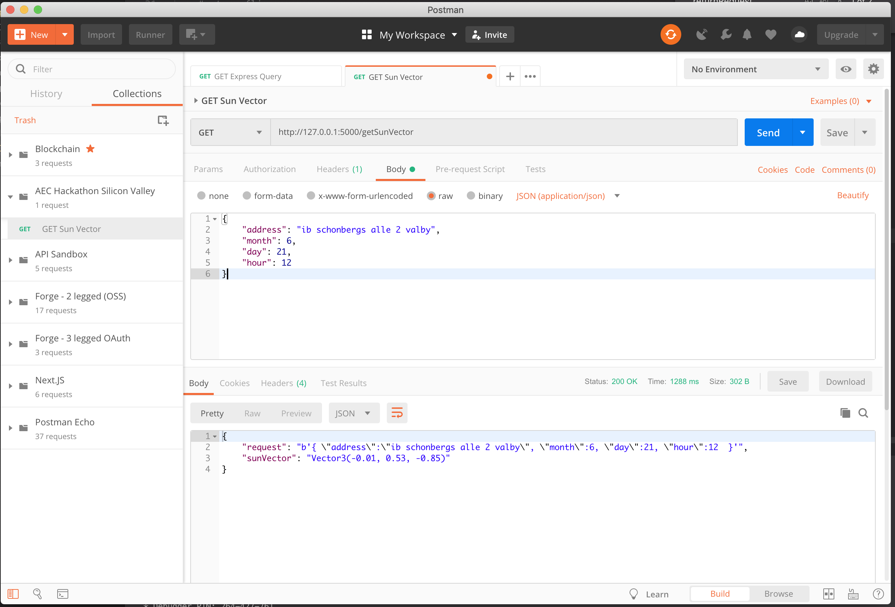

# Urban Insights Backend

Backend for Urban Insights App.

[](https://shields.io/)

## Purpose

The Python backend houses the business logic for modle parsing, analysis, and geometry operations which are fed back into the frontend for realtime visualization with AR/VR.

## Endpoints

**GET /cutObj**

> **Takes** Nothing yet
> **Returns** An OBJ model serialized to JSON.

**GET /getSunVector**

> **Takes** Body of data with the follwing param headers:
```json
{
    "address": "ib schonbergs alle 2 valby",
    "month": 6,
    "day": 21,
    "hour": 12
}
```
> **Returns** A string representation of the Sun Vector.

